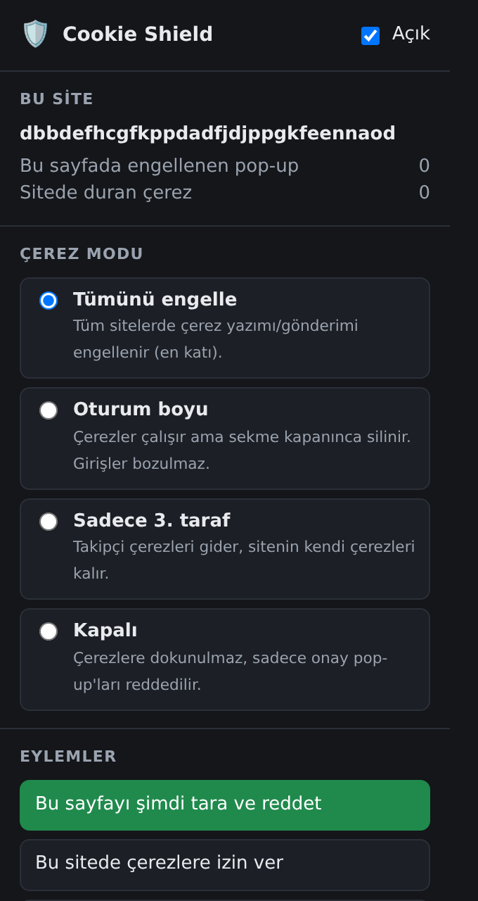
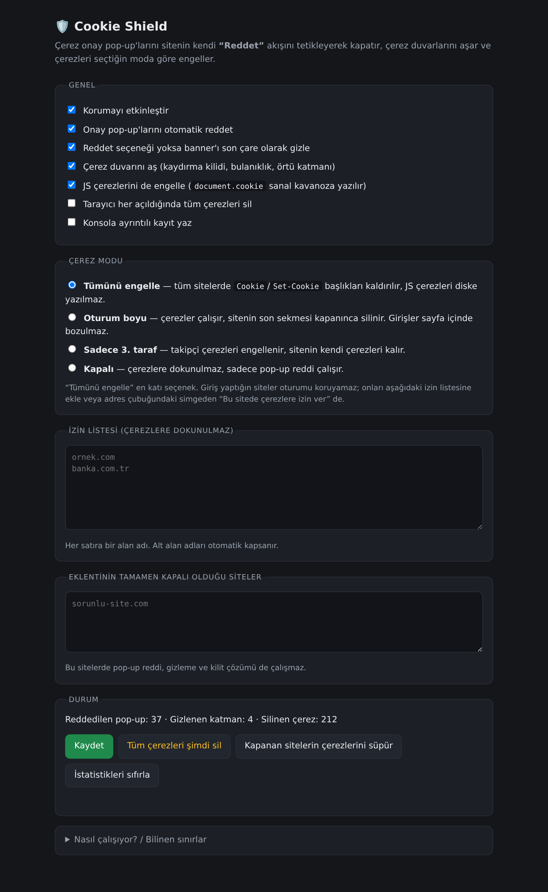
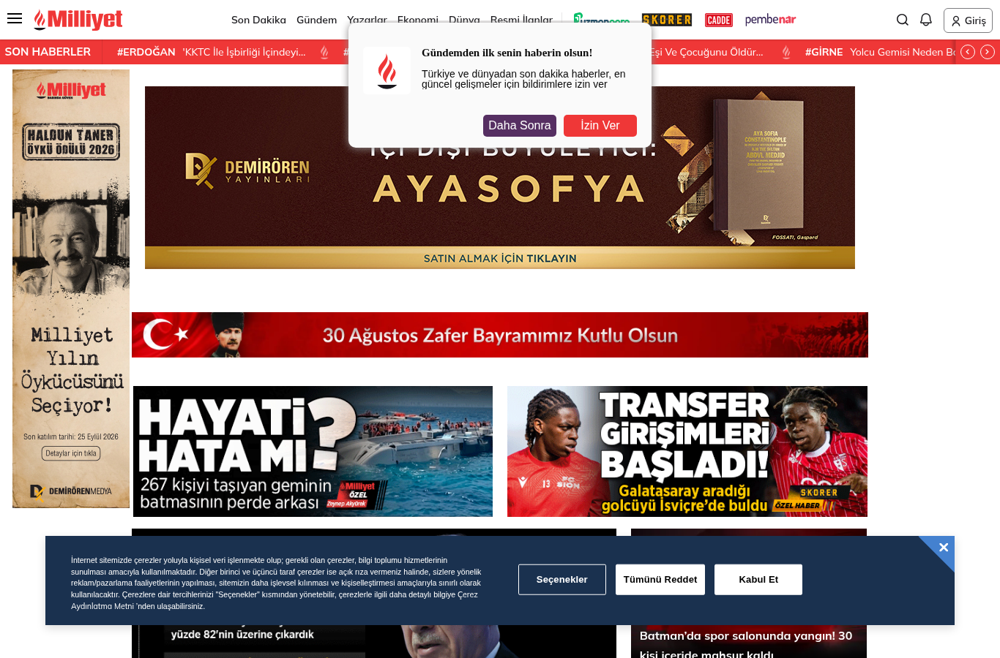
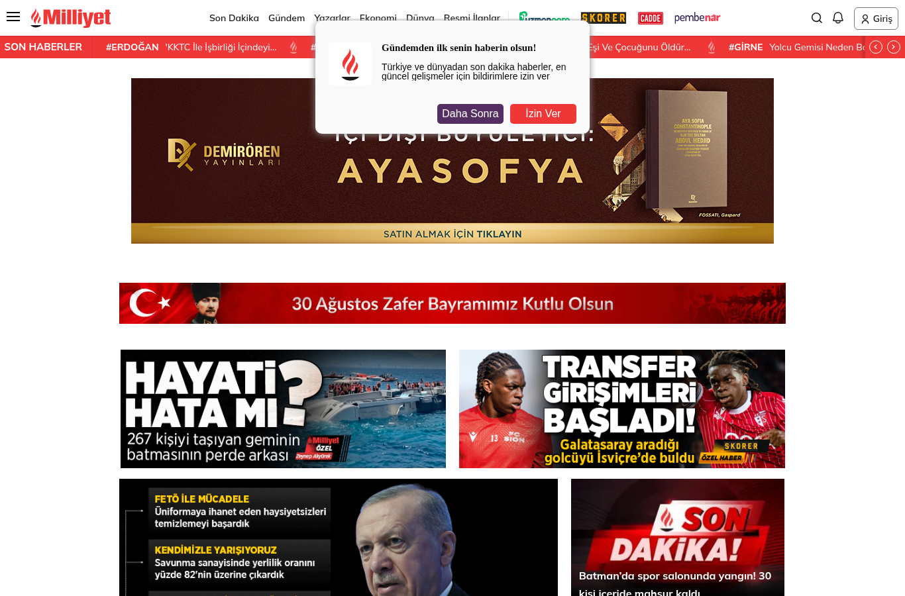

# 🛡️ Cookie Shield

Brave (ve Chromium tabanlı diğer tarayıcılar) için Manifest V3 eklentisi.

Üç işi birlikte yapar:

1. **Çerez onay pop-up'larını kapatır** — banner'ı sadece gizlemek yerine sitenin
   kendi *"Tümünü Reddet"* akışını tetikler. Site rızayı **red** olarak kaydeder,
   bu yüzden özellikler kapanmaz ve banner her ziyarette geri gelmez.
2. **Tüm sitelerde çerezleri engeller** — `Cookie` / `Set-Cookie` başlıkları
   ağ katmanında (declarativeNetRequest) kaldırılır, JS ile yazılan çerezler
   silinir veya hafızadaki *sanal kavanoza* yönlendirilir.
3. **Reddetmeye izin vermeyen siteleri aşar** — çerez duvarı, kaydırma kilidi,
   bulanıklık ve örtü katmanı temizlenir; her istekte `Sec-GPC: 1` + `DNT: 1`
   gönderilir ve Google Consent Mode'a `denied` bildirilir.

## Kurulum (Brave / Chrome / Edge)

```bash
git clone https://github.com/<kullanici>/cookie-shield.git
```

veya GitHub'daki **Code → Download ZIP** ile indirip bir yere çıkart.

1. `brave://extensions` adresini aç (Chrome'da `chrome://extensions`,
   Edge'de `edge://extensions`).
2. Sağ üstten **Geliştirici modu**nu aç.
3. **Paketlenmemiş öğe yükle** → indirdiğin `cookie-shield` klasörünü seç
   (`manifest.json` dosyasının bulunduğu klasör).
4. Adres çubuğunun yanındaki 🛡️ simgesinden modu seç. Simge görünmüyorsa
   yapboz parçası menüsünden sabitle.

İlk kurulumda ayarlar sayfası otomatik açılır. Eklenti güncellendiğinde
`brave://extensions` üzerindeki **yeniden yükle** (🔄) düğmesine bas.

> `npm install` kurulum için gerekli değildir; bağımlılıklar yalnızca testlerde
> kullanılır. Dağıtılabilir bir arşiv istersen `npm run package` →
> `dist/cookie-shield.zip`.

## Ekran görüntüleri

| Popup | Ayarlar |
| --- | --- |
|  |  |

Saha kanıtı (milliyet.com.tr, eklenti kapalı → açık):

| Kapalı: banner + 25 çerez | Açık: banner yok, 0 çerez |
| --- | --- |
|  |  |


## Çerez modları

| Mod | Ne yapar | Kime uygun |
| --- | --- | --- |
| **Tümünü engelle** (varsayılan) | Tüm sitelerde çerez yazımı ve gönderimi engellenir. `document.cookie` sanal kavanoza yazılır: sayfa çalışır, çerez diske yazılmaz, sunucuya gitmez. | En katı gizlilik. Giriş yapılan siteler izin listesine eklenmeli. |
| **Oturum boyu** | Çerezler normal çalışır, sitenin son sekmesi kapanınca silinir. Üçüncü taraf çerezler yine engellenir. | "Girişler bozulmasın ama iz kalmasın" isteyenler. |
| **Sadece 3. taraf** | Takipçi çerezleri engellenir, sitenin kendi çerezleri kalır. | Günlük kullanım, en az sürtünme. |
| **Kapalı** | Çerezlere dokunulmaz, sadece pop-up reddi çalışır. | Yalnızca banner'lardan kurtulmak isteyenler. |

**İzin listesi:** Banka, e-posta, iş panelleri gibi oturumun kalması gereken
siteleri popup'taki *"Bu sitede çerezlere izin ver"* ile veya ayarlar
sayfasındaki listeye ekleyerek muaf tut. Alt alan adları otomatik kapsanır.

## Nasıl çalışıyor?

```
manifest.json
├── src/page/page-agent.js      MAIN dünya: CMP JS API'leri, sanal çerez kavanozu, GPC
├── src/content/core.js         Banner puanlama + çok dilli buton sınıflandırma
├── src/content/adapters.js     25+ CMP için özel seçiciler (shadow DOM dahil)
├── src/content/engine.js       Akış: adaptör → sezgisel → son çare + zamanlama
├── src/background/service-worker.js  Mod uygulama, DNR kuralları, çerez silme, istatistik
├── rules/*.json                Çerez başlığı sıyırma + GPC/DNT sinyali kuralları
└── src/popup, src/options      Arayüz
```

Reddetme sırası (ilki tutunca durur):

1. **CMP'nin kendi API'si** — `OneTrust.RejectAll()`, `Cookiebot.decline()`,
   `Didomi.setUserDisagreeToAll()`, `UC_UI.denyAllConsents()`, `Osano.cm.denyAll()`,
   `klaro`, `_iub.cs.api.reject()`, `cmplz_deny_all()`, `tarteaucitron`,
   `ppms.cm.api('rejectAllConsents')`, `__cmp('rejectAll')` …
2. **CMP adaptörü** — OneTrust, Cookiebot, Quantcast, Didomi, Usercentrics, Osano,
   Iubenda, Klaro, Termly, CookieYes, Complianz, Borlabs, Sourcepoint, TrustArc,
   Axeptio, tarteaucitron, FundingChoices, HubSpot, Cookie Script, WP eklentileri,
   Moove, Piwik PRO, Sirdata, Ketch (Shadow DOM'a da bakar).
3. **Sezgisel tarama** — banner adayları konum/z-index/sınıf adı/metin/buton
   türlerine göre puanlanır; "Reddet" butonu yoksa tercih paneli açılır, isteğe
   bağlı kutular kapatılır ve kaydedilir. **Zorunlu/gerekli kutulara dokunulmaz.**
4. **Son çare** — rıza hiç kaydedilemiyorsa banner + perde gizlenir ve sayfa kilidi
   açılır. Yalnızca çerez bağlamı doğrulanan öğelere uygulanır; `main`/`article`
   içeren veya 40'tan fazla bağlantı barındıran öğeler banner sayılmaz.

Türkçe dahil 10+ dil desteklenir (`Tümünü Reddet`, `Sadece Zorunlu Çerezler`,
`Kabul Etmiyorum`, `Alle ablehnen`, `Continuer sans accepter`, `Solo las necesarias`…).
`İ`/`ı` gibi Türkçe karakterler Unicode NFD ile normalize edilir.

## Bilinen sınırlar

- **Sunucu tarafı çerez duvarı** (içerik hiç gönderilmiyorsa) tarayıcı eklentisiyle
  aşılamaz — orada abonelik/ödeme duvarı vardır.
- **Tümünü engelle** modunda oturum açılan siteler izin listesine eklenmezse
  "çıkış yapıldı" davranışı normaldir. Popup bunu hatırlatır.
- Geçerli TCF onay dizesi (TCString) üretilmez; standart dışı `rejectAll` komutunu
  desteklemeyen TCF CMP'lerinde DOM tıklaması veya son çare devreye girer.
- `document.cookie` koruması `document_start`'ta kurulur; ayarlar okunana kadarki
  yazımlar tamponlanır (engelleme kapalıysa gerçek çerezlere aktarılır, açıksa
  kavanozda kalır). Hiçbir yazım kaybolmaz.

## Test

```bash
npm install            # jsdom + puppeteer-core (yalnızca test için)
npm run lint           # tüm kaynaklarda söz dizimi kontrolü
npm test               # 19 birim/DOM testi (jsdom)
npm run e2e            # gerçek Brave'de 18 uçtan uca kontrol
node test/real-sites.mjs   # canlı sitelerde saha kontrolü (ağ gerekir)
```

Son doğrulama durumu:

- `npm test` → 19/19 geçti
- `npm run e2e` → 18/18 geçti (gerçek reddet tıklaması, API çağrısı, `Set-Cookie`
  engelleme, sanal kavanoz, çerez duvarı, izin listesi istisnası, arayüzler)
- `test/real-sites.mjs` → BBC, Hepsiburada, Milliyet, Zeit, Guardian: banner temiz,
  0 çerez, 13 gerçek reddetme; içerik karşılaştırmasında metin/bağlantı/görsel
  sayıları eklentisiz duruma **eşit** (site bozulmuyor).

## Gizlilik

Hiçbir veri dışarı gönderilmez. Tüm ayarlar ve sayaçlar `chrome.storage.local`
içinde kalır; uzak sunucu, analitik veya güncelleme çağrısı yoktur.

## Lisans

[MIT](LICENSE) © Berat Yumak
